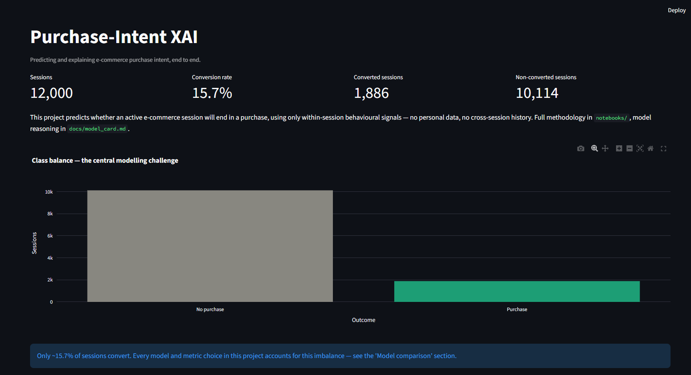
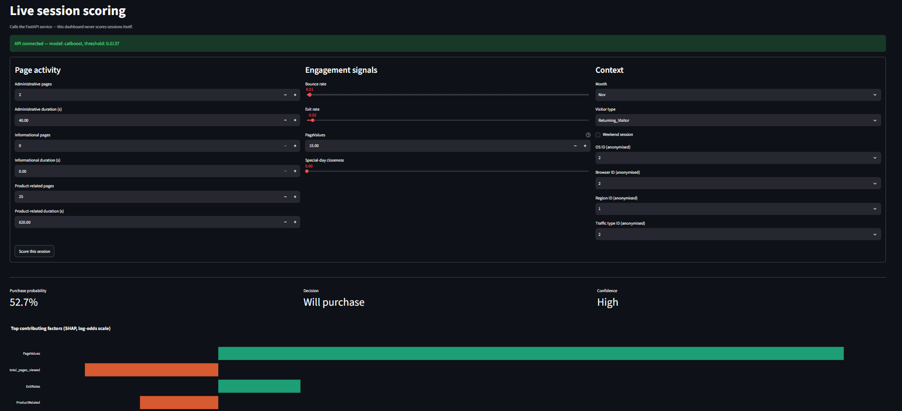
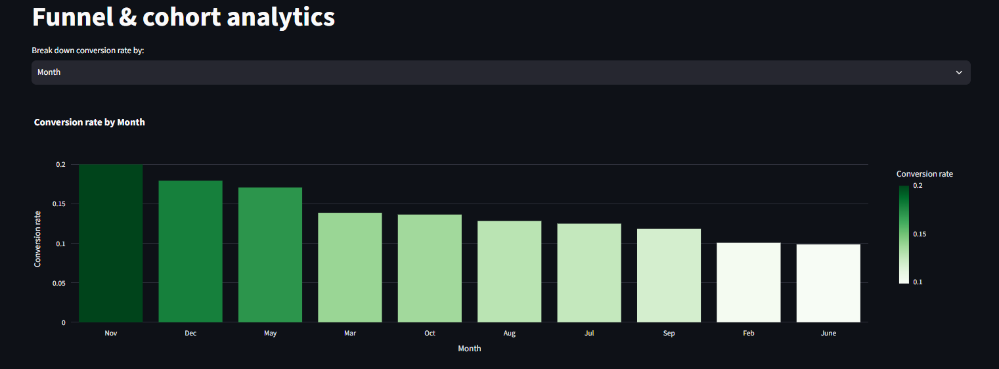
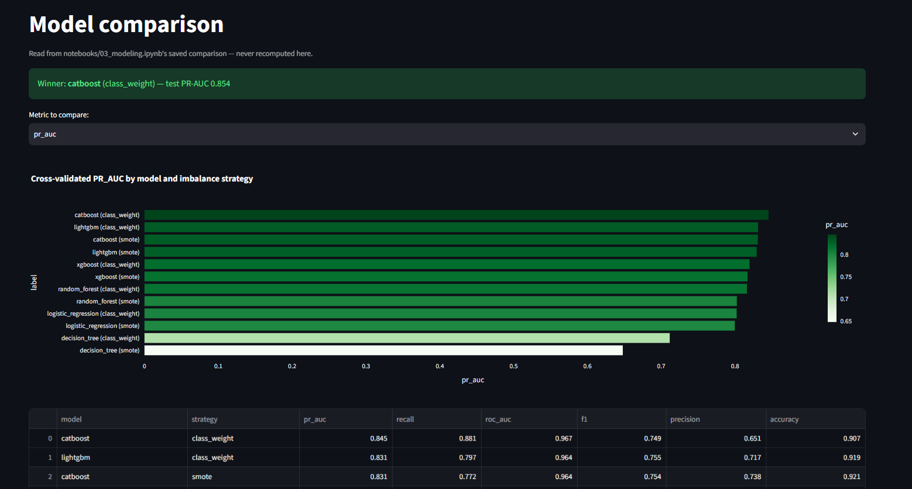
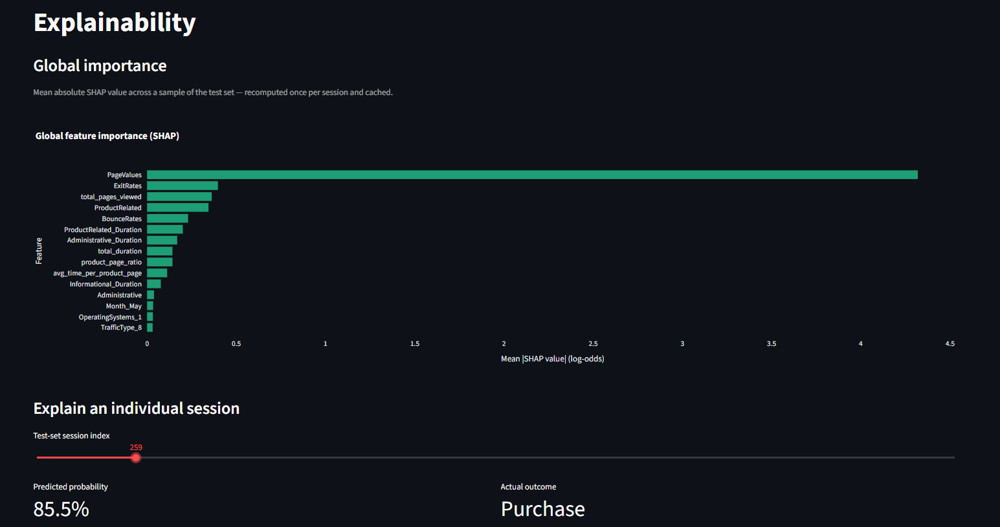
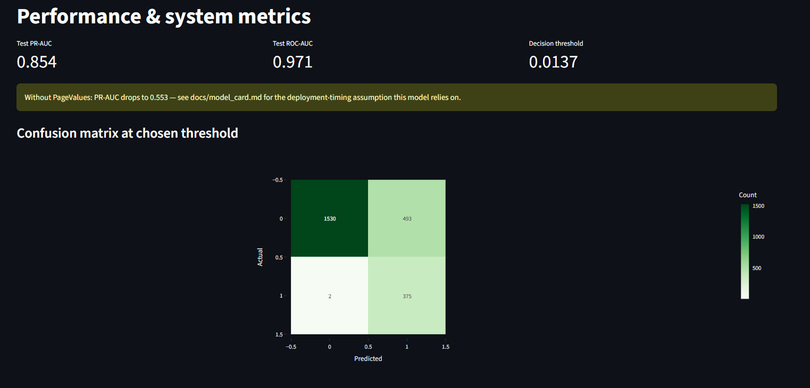
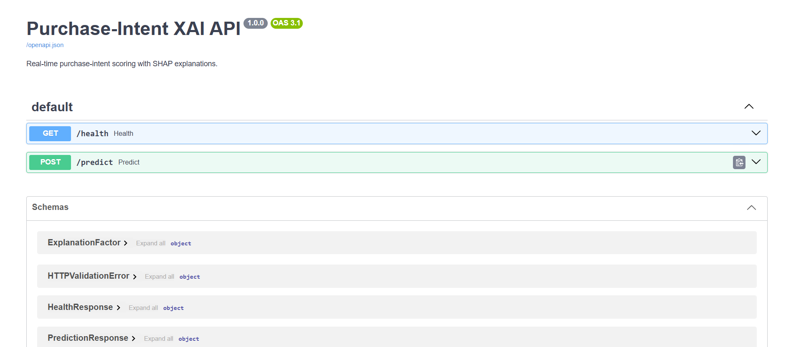
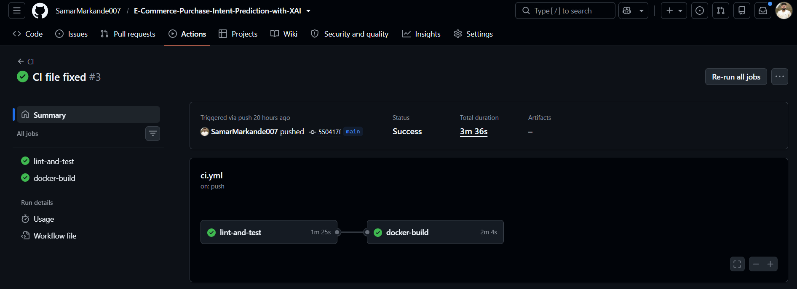
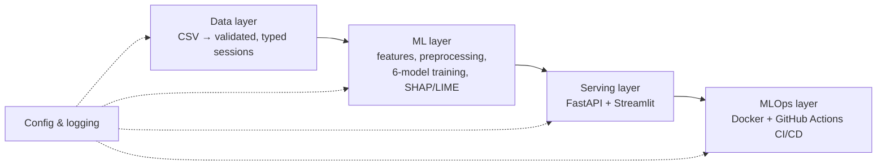

# Purchase-Intent Prediction with Explainable AI

Predicting whether an e-commerce session will end in a purchase — with a full MLOps pipeline, a real-time API, an interactive dashboard, and SHAP/LIME explanations for every prediction.

[](https://github.com/SamarMarkande007/E-Commerce-Purchase-Intent-Prediction-with-XAI/actions/workflows/ci.yml)

---

## Overview

This project takes the [Online Shoppers Purchasing Intention](https://archive.ics.uci.edu/dataset/468/online+shoppers+purchasing+intention+dataset) dataset (12,000 sessions, ~15.7% conversion rate) and builds an end-to-end system around it:

- **Data pipeline** — validated ingestion, behavioural feature engineering, leakage-aware preprocessing
- **Modelling** — 6 algorithms compared under 2 imbalance strategies via stratified cross-validation, tracked in MLflow
- **Explainability** — SHAP (global + local) and LIME, cross-checked against each other, for every prediction
- **Serving** — a FastAPI service and a 6-section Streamlit dashboard, both reading from the same trained artifacts
- **MLOps** — Dockerized, with a CI/CD pipeline that builds, runs, and health-checks the whole stack on every push

The project deliberately surfaces and resolves a real modelling trap: `PageValues`, the single strongest predictor, may not be genuinely known at the moment a session is actually scored — see [Key Findings](#key-findings) and [`docs/model_card.md`](docs/model_card.md) for how this was investigated and resolved rather than ignored.

---

## Screenshots

| | |
|---|---|
| **Dashboard — Overview** | **Dashboard — Live Scoring** |
|  |  |
| **Dashboard — Funnel & Cohort Analytics** | **Dashboard — Model Comparison** |
|  |  |
| **Dashboard — Explainability** | **Dashboard — Performance Metrics** |
|  |  |
| **API — Interactive Docs** | **CI/CD — GitHub Actions** |
|  |  |


---

## Architecture



The dashboard and API both read from the **same** saved pipeline (`models/best_pipeline.joblib`) — neither retrains, and neither reimplements preprocessing independently, which avoids train/serve skew.

---

## Tech stack

| Layer | Tools |
|---|---|
| Data & features | pandas, NumPy, scikit-learn |
| Imbalance handling | imbalanced-learn (SMOTE), class-weighting |
| Models | Logistic Regression, Decision Tree, Random Forest, XGBoost, LightGBM, CatBoost |
| Explainability | SHAP, LIME |
| Experiment tracking | MLflow |
| API | FastAPI, Pydantic, uvicorn |
| Dashboard | Streamlit, Plotly |
| Testing | pytest (48 tests) |
| Containerization | Docker, Docker Compose |
| CI/CD | GitHub Actions |

---

## Repository structure

```
purchase-intent-xai/
├── dataset/                    # Source CSVs
├── notebooks/
│   ├── 01_eda.ipynb             # Data understanding
│   ├── 02_features.ipynb        # Feature engineering & selection
│   ├── 03_modeling.ipynb        # 6-model comparison, threshold, PageValues ablation
│   └── 04_xai.ipynb             # SHAP + LIME, model card source
├── src/
│   ├── config/                  # config.yaml + typed settings loader
│   ├── data/                    # Ingestion + validation
│   ├── features/                # Reusable feature engineering
│   ├── preprocessing/           # ColumnTransformer + imbalance pipeline
│   ├── models/                  # Trainer class + evaluation metrics
│   ├── explain/                 # SHAP explanation wrapper (used by the API)
│   ├── api/                     # FastAPI app + Pydantic schemas
│   └── utils/                   # Logging, exceptions
├── dashboard/
│   └── app.py                   # 6-section Streamlit dashboard
├── models/                      # Saved pipeline, metadata, comparison results
├── tests/                       # 48 tests across every module above
├── docker/
│   ├── Dockerfile.api
│   └── Dockerfile.dashboard
├── docker-compose.yml
├── .github/workflows/ci.yml     # Lint, test, build & health-check both containers
├── docs/
│   └── model_card.md
├── requirements.txt
└── pyproject.toml
```

---

## Getting started

### 1. Clone and set up the environment

```bash
git clone https://github.com/SamarMarkande007/E-Commerce-Purchase-Intent-Prediction-with-XAI.git
cd E-Commerce-Purchase-Intent-Prediction-with-XAI

python -m venv purchase_env
purchase_env\Scripts\activate      # Windows
# source purchase_env/bin/activate # macOS/Linux

pip install -r requirements.txt
```

### 2. Run the notebooks, in order

```
notebooks/01_eda.ipynb        # Data understanding
notebooks/02_features.ipynb   # Feature engineering & selection
notebooks/03_modeling.ipynb   # Trains all 6 models, saves the winning pipeline
notebooks/04_xai.ipynb        # SHAP + LIME explanations, model card
```

`03_modeling.ipynb` must be run at least once before the API or dashboard — it's what creates `models/best_pipeline.joblib`.

### 3. Run the tests

```bash
pytest tests/ -v
```

### 4. Run the API

```bash
uvicorn src.api.main:app --reload
```
Interactive docs: `http://127.0.0.1:8000/docs`

### 5. Run the dashboard

```bash
streamlit run dashboard/app.py
```
Open: `http://localhost:8501` (requires the API running in a separate terminal for the Live Scoring section)

### 6. Or run everything via Docker

```bash
docker compose up --build
```
- API: `http://localhost:8000/docs`
- Dashboard: `http://localhost:8501`

```bash
docker compose down   # stop everything
```

---

## Key findings

- **Class imbalance is real and central**: ~15.7% conversion rate. A model predicting "no purchase" for every session scores ~84.5% accuracy while catching zero buyers — so every evaluation in this project leads with **PR-AUC and recall**, not accuracy.
- **`PageValues` dominates** every analysis — EDA correlation (0.64), feature importance, and SHAP global importance all agree.
- **This dominance was stress-tested, not assumed**: removing `PageValues` drops test PR-AUC from **0.854 to 0.553** (a 35% relative drop). The project makes an explicit, documented assumption about *when* a session is scored (late-session, e.g. at checkout) to justify using it — see the model card for the alternative if your deployment scores earlier.
- **The decision threshold is value-based, not 0.5** — derived from an assumed $100 conversion value vs. a $5 intervention cost, which is why it lands at an aggressive ~0.014 (favouring recall heavily). Replace these placeholder figures with real business numbers before any production use.
- **SHAP and LIME independently agree** on the dominant features for individual sessions — genuine cross-validation of the explanation, not just one tool's opinion.

### Model comparison (cross-validated PR-AUC)

| Model | Strategy | PR-AUC |
|---|---|---|
| **CatBoost** | class_weight | **0.845** (winner) |
| LightGBM | class_weight | 0.831 |
| CatBoost | smote | 0.831 |
| LightGBM | smote | 0.829 |
| Random Forest | both | ~0.78 |
| Logistic Regression | both | ~0.72 |
| Decision Tree | both | ~0.65–0.71 |

**Held-out test set:** PR-AUC 0.854, ROC-AUC 0.971.

Full reasoning for every decision above lives in the notebooks themselves and in [`docs/model_card.md`](docs/model_card.md) — this README summarizes, it doesn't replace them.

---

## Testing & CI/CD

48 tests across data loading, feature engineering, preprocessing (including a dedicated no-leakage check on SMOTE), model training, SHAP explanations, the API, and the dashboard (using Streamlit's `AppTest`, no browser required).

GitHub Actions runs on every push to `main`:
1. **`lint-and-test`** — `ruff`, `black --check`, full `pytest` suite
2. **`docker-build`** — builds both Docker images, starts them for real via `docker compose`, and verifies both `/health` (API) and `/_stcore/health` (dashboard) respond correctly on a clean machine

This repo intentionally commits `models/`, `mlruns/`, and `catboost_info/` (rather than `.gitignore`-ing them) so that CI — and anyone cloning this repo — gets a fully working, reproducible system without needing to retrain anything first.

---

